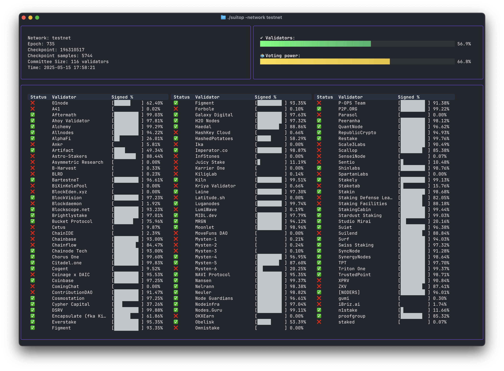

# `suitop` - Sui Uptime Monitor

Monitors validator uptime on the Sui network by subscribing to checkpoint data. Features a modern terminal user interface (TUI) with real-time updates.



## Features

- Real-time monitoring of validator signatures on checkpoints
- Dual progress bars: validator count and voting-power participation per checkpoint
- Interactive TUI with progress bars and formatted tables
- Plain text mode for logging or scripting use cases
- Automatic terminal resizing support
- Graceful shutdown handling for clean exits

## Configuration

The application can be configured using environment variables:

- `SUI_NODE`: The gRPC endpoint for Sui node subscriptions (e.g., `fullnode.mainnet.sui.io:443`).
- `SUI_JSON_RPC_URL`: The JSON-RPC endpoint for Sui fullnode (e.g., `https://fullnode.mainnet.sui.io`).
- `DEFAULT_RPC_TIMEOUT_SECONDS`: Timeout for JSON-RPC calls in seconds (default: 15).
- `GRPC_USE_TLS`: Set to `true` or `false` to enable/disable TLS for gRPC (default: `true`).
- `GRPC_INSECURE_SKIP_VERIFY`: Set to `true` or `false` to skip TLS certificate verification for gRPC (default: `true`).
- `SUBSCRIBER_RETRY_DELAY_MS`: Delay in milliseconds before retrying gRPC subscription (default: 1000).
- `PLAIN_MODE`: Set to `true` to use plain text output instead of TUI (default: `false`).
- `NO_ALT_SCREEN`: Set to `true` to run inside current terminal buffer (default: `false`).
- `LOG_TO_FILE`: Set to `true` to write logs to a file (default: `false`).
- `LOG_FILE_PATH`: Path to log file (default: `~/.suitop/logs/suitop.log`).
- `GENERATE_DATASET`: Enable dataset generation mode (default: `false`).
- `DATASET_FOLDER`: Folder to store dataset files (default: `./data`).

## Command-line Flags

These flags override the corresponding environment variables:

- `--plain`: Use plain text output instead of TUI
- `--no-alt-screen`: Run inside current terminal buffer (useful for tmux logs)
- `--log-to-file`: Write logs to a file
- `--log-file [path]`: Path to log file
- `--generate-dataset`: Enable dataset generation mode

## Building

```bash
go build -o suitop cmd/suitop/main.go
```

To embed version information:
```bash
go build -ldflags "-X suitop/internal/version.GitCommit=$(git rev-parse HEAD) -X suitop/internal/version.BuildTime=$(date -u +%Y-%m-%dT%H:%M:%SZ) -X suitop/internal/version.Version=0.1.0" -o suitop cmd/suitop/main.go
```

## Running

```bash
# Run with default TUI mode
./suitop

# Run for testnet
./suitop --network testnet

# Run with plain text output
./suitop --plain

# Run inside current terminal buffer (good for tmux sessions)
./suitop --no-alt-screen

# Run with logging to a file
./suitop --log-to-file --log-file /path/to/logfile.log

# Generate dataset in plain mode
./suitop --generate-dataset
```

## Dataset Mode

When `--generate-dataset` (or `GENERATE_DATASET=true`) is enabled the tool runs
in plain mode and keeps validator signatures in memory until you press `q` then
`Enter`.

Every epoch is flushed to a JSON file inside `DATASET_FOLDER` (defaults to
`./data`).  Files are named `epoch_<epoch>_<start>-<end>.json` where `<start>` and
`<end>` are the first and last checkpoint sequence numbers recorded.

The JSON structure contains an array of validators with a bitmap of all
checkpoints in order:

```json
{
  "epoch": 42,
  "start_checkpoint": 10000,
  "end_checkpoint": 10100,
  "validators": [
    {
      "name": "Validator A",
      "address": "0x...",
      "signed": 90,
      "total": 101,
      "bitmap": "...base64 bytes..."
    }
  ]
}
```

The `bitmap` field is base64‑encoded.  When decoded, each bit corresponds to a
checkpoint starting from the least significant bit of the first byte.  A set bit
(value `1`) means the validator signed that checkpoint.

Progress is printed every 10 checkpoints with a reminder that you can press `q`
to finish recording.

## Usage

- Press `q` or `Ctrl+C` to quit the application
- Terminal resizing is automatically handled
- Use `SIGINT` (Ctrl+C) or `SIGTERM` for graceful shutdown

## Project Structure

(Details of the project structure as provided in the refactoring request can be added here.)

```
suitop/
├── go.mod
├── go.sum
│
├── cmd/                     
│   └── suitop/
│       └── main.go          
│
├── internal/                
│   ├── config/              
│   │   └── config.go
│   ├── rpc/                 
│   │   ├── client.go        
│   │   ├── committee.go     
│   │   └── systemstate.go   
│   ├── grpc/                
│   │   ├── subscriber.go    
│   │   └── interceptors.go  
│   ├── checkpoint/          
│   │   ├── bitmap.go        
│   │   ├── processor.go     
│   │   └── stats.go         
│   ├── validator/           
│   │   ├── model.go         
│   │   └── loader.go        
│   ├── tui/                 
│   │   ├── messages.go      
│   │   ├── model.go         
│   │   ├── update.go        
│   │   ├── view.go          
│   │   └── style.go         
│   ├── types/               
│   │   └── common.go        
│   ├── util/                
│   │   ├── logger.go        
│   │   ├── retry.go         
│   │   └── signalctx.go     
│   └── version/             
│       └── version.go
│
├── pb/                      
│   ├── sui/rpc/v2alpha/*.go
│   └── sui/rpc/v2beta/*.go
│
└── README.md
``` 